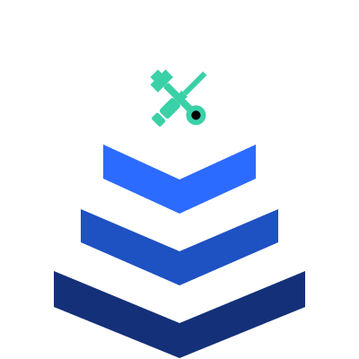

# IIM Workbench

<p align="center">
  
</p>

<h2 align="center">Infrastructure Intelligence Model Workbench</h2>

<p align="center">
  A local workspace for building, validating, visualizing, importing, and exporting IIM chains, patterns, and feeds.
</p>

<p align="center">
  <a href="https://iim.malwarebox.eu">IIM Reference</a>
  ·
  <a href="https://workbench.iim.malwarebox.eu">Web Version</a>
</p>

## Overview

IIM Workbench is a local tool for working with the Infrastructure Intelligence Model.

It helps analysts describe adversary infrastructure as structured chains instead of isolated indicators. The Workbench can be used to build IIM chains, validate chain and pattern JSON, browse the IIM technique catalog, visualize infrastructure flows, and export data into STIX 2.1.

The tool is designed for local use. By default, it runs on `127.0.0.1` and does not require any external service.

## What it does

IIM Workbench provides:

- Chain building for observed infrastructure entities
- Role assignment for infrastructure positions such as `entry`, `redirector`, `staging`, `payload`, and `c2`
- Technique annotation using the IIM technique catalog
- Relation modeling between infrastructure entities
- Structural validation for chains and patterns
- Pattern extraction from concrete chains
- STIX 2.1 export
- STIX 2.1 import with review metadata
- Interactive chain and pattern visualization
- Local API endpoints for validation, catalog access, and export workflows

## Why this exists

Traditional IOC feeds often lose the structure around malicious infrastructure. They describe what was observed, but not always how the infrastructure was composed, routed, gated, staged, or reused.

IIM Workbench is built to make that structure explicit.

It is not intended to replace STIX, ATT&CK, or IOC feeds. It complements them by focusing on infrastructure composition and chain behavior.

## Installation

Clone the repository:

```bash
git clone https://github.com/MalwareboxEU/IIM-Workbench.git
cd IIM-Workbench
```

Create a virtual environment:

```bash
python3 -m venv .venv
source .venv/bin/activate
```

Install Flask:

```bash
pip install flask
```

Start the Workbench:

```bash
python iim_workbench.py
```

Open the local interface:

```text
http://127.0.0.1:5000
```

## Usage

Start the local web interface:

```bash
python iim_workbench.py
```

Start on a custom port:

```bash
python iim_workbench.py --port 8080
```

Bind to a custom host:

```bash
python iim_workbench.py --host 0.0.0.0 --port 8080
```

Validate an IIM chain or pattern from the CLI:

```bash
python iim_workbench.py --validate chain.json
```

Export an IIM chain to STIX 2.1:

```bash
python iim_workbench.py --stix chain.json > bundle.json
```

Use a custom technique catalog:

```bash
python iim_workbench.py --catalog ./techniques/iim-techniques-v1.0.json
```

You can also set the catalog path through an environment variable:

```bash
export IIM_CATALOG="./techniques/iim-techniques-v1.0.json"
python iim_workbench.py
```

## Technique catalog

The Workbench loads the IIM technique catalog from:

```text
./techniques/iim-techniques-v1.0.json
```

If the catalog is not found, the application still starts with a minimal embedded fallback catalog. This allows the interface and validator to run, but full technique validation requires the real catalog.

## IIM chain model

A chain describes observed infrastructure as a sequence of role-based positions.

Example roles:

```text
entry
redirector
staging
payload
c2
```

Example entity types:

```text
url
domain
ip
file
hash
email
certificate
asn
```

Example relation types:

```text
download
redirect
drops
execute
connect
resolves-to
references
communicates-with
```

A minimal chain looks like this:

```json
{
  "iim_version": "1.1",
  "chain_id": "example-chain",
  "entities": [
    {
      "id": "e1",
      "type": "url",
      "value": "https://example.invalid/lure"
    },
    {
      "id": "e2",
      "type": "domain",
      "value": "c2.example.invalid"
    }
  ],
  "chain": [
    {
      "entity_id": "e1",
      "role": "entry",
      "techniques": []
    },
    {
      "entity_id": "e2",
      "role": "c2",
      "techniques": []
    }
  ],
  "relations": [
    {
      "from": "e1",
      "to": "e2",
      "type": "connect",
      "sequence_order": 1
    }
  ]
}
```

## Web interface

The local UI includes several work areas.

### Chain Builder

Build an IIM chain by adding observed entities, assigning role positions, adding techniques, and declaring relations.

### Visualize

Render chains and patterns as interactive diagrams. The visualizer supports a linear flow mode and a relation-focused graph mode.

### Interop

Convert between IIM and STIX 2.1.

IIM to STIX export preserves IIM-specific concepts through `x_iim_*` custom properties.

STIX to IIM import is heuristic unless the source bundle already contains IIM metadata. Imported chains should be reviewed before publishing.

### Technique Catalog

Browse and search the loaded IIM technique catalog.

### Validator

Validate chain and pattern JSON without using the builder.

## API endpoints

The local Flask app exposes the following endpoints:

```text
GET  /api/health
GET  /api/catalog
GET  /api/techniques
GET  /api/techniques/<ID>
POST /api/validate/chain
POST /api/validate/pattern
POST /api/export/stix
POST /api/import/stix
POST /api/export/pattern
```

Example validation request:

```bash
curl -s http://127.0.0.1:5000/api/validate/chain \
  -H "Content-Type: application/json" \
  -d @chain.json
```

Example STIX export request:

```bash
curl -s http://127.0.0.1:5000/api/export/stix \
  -H "Content-Type: application/json" \
  -d @chain.json > bundle.json
```

## STIX 2.1 export

The Workbench maps IIM chains into STIX 2.1 bundles using:

- `indicator` objects for observed entities
- `infrastructure` objects for role positions
- `attack-pattern` objects for IIM techniques
- `relationship` objects for infrastructure flow and technique usage
- `grouping` objects to wrap the full IIM chain context

IIM-specific semantics are preserved with custom properties such as:

```text
x_iim_chain_id
x_iim_role
x_iim_position
x_iim_techniques
x_iim_relation_type
x_iim_sequence_order
```

## STIX import

The Workbench can import STIX 2.1 bundles and convert them into IIM chains.

If the bundle contains IIM custom properties, the import can recover the original structure more accurately.

If the bundle does not contain IIM metadata, the importer infers what it can and marks the result for analyst review.

## Project structure

Recommended layout:

```text
IIM-Workbench/
├── README.md
├── LICENSE
├── iim_workbench.py
├── iim_stix.py
├── workbench-logo.svg
└── techniques/
    └── iim-techniques-v1.0.json
```

## Requirements

Required:

```text
Python 3.10+
Flask
```

Optional:

```text
iim_stix.py
```

The optional `iim_stix.py` module enables the extended STIX import and export path. If it is not present, the Workbench uses the built-in STIX export implementation.

## Security notes

The Workbench is intended to run locally.

Default bind address:

```text
127.0.0.1
```

Only bind to `0.0.0.0` if you know why you need it and have placed the service behind appropriate access controls.

## Related links

- IIM Reference: https://iim.malwarebox.eu
- IIM Workbench Web Version: https://workbench.iim.malwarebox.eu
- Malwarebox: https://malwarebox.eu

## Author

Robin Dost  
Malwarebox

## License

Apache-2.0
